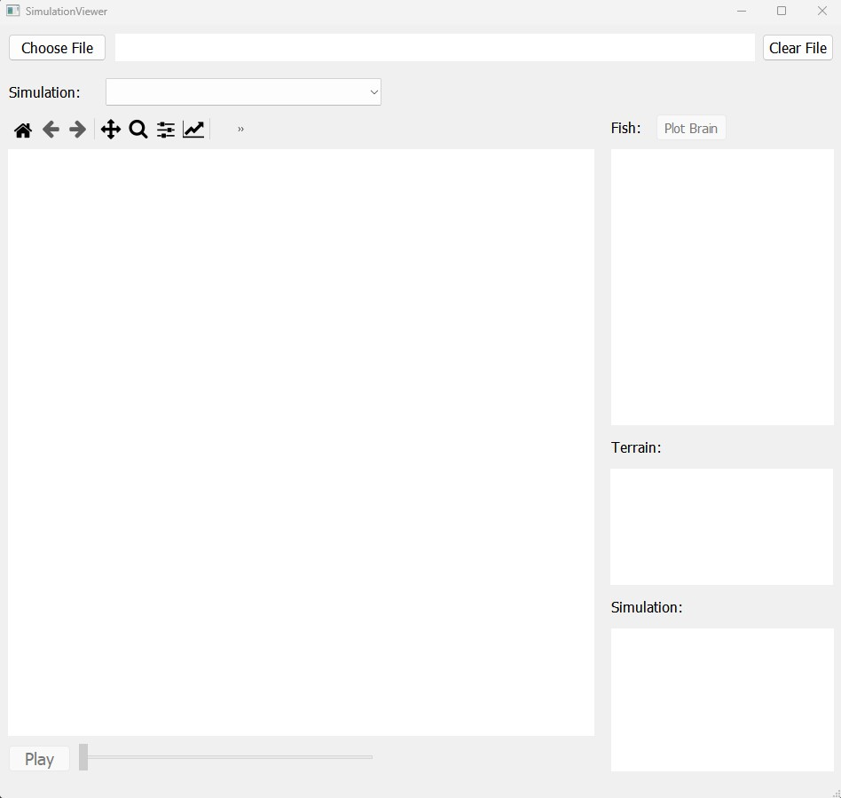
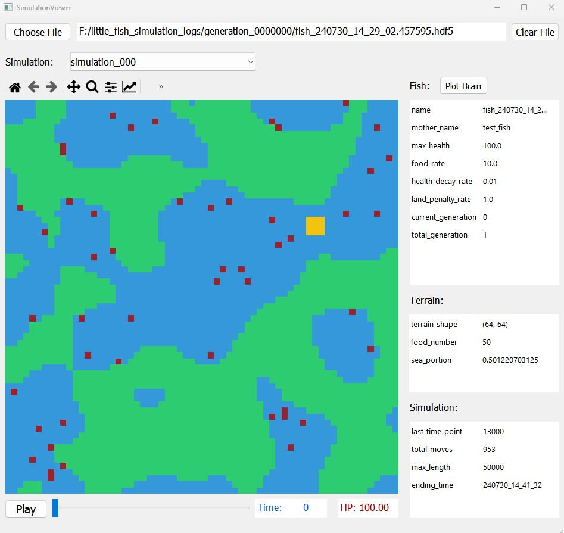

# The Little Fish
This is a hobby project that explores how the intelligence of a neural network (i.e. a primitive brain) might be optimized (i.e. evolved) across generations without using back propagation and real-time feedback.   
Detailed description can be found in this webpage: [The Little Fish](https://sites.google.com/view/thelittlefish/home)

## Install:
```
>>> git clone https://github.com/zhuangjun1981/littlefish
>>> cd littlefish
>>> python setup.py install
```

## Run simulation
- first edit the `<repo directory>/littlefish/scripts/for_simulation/run_simulation_1.py`
  - modify `data_folder` to be a directory for saving simulation logs (can be several Gigs) 
  - if running from scratch, make sure `start_generation_ind = 0`
- Then run the script in python:
  ```python <repo directory>/littlefish/scripts/for_simulation/run_simulation_1.py```

## View simulation
- First start simulation viewer:
```
python <repo directory>/littlefish/viewer/simulation_viewer.py
```

- Click the `Choose File` button 
- Pick any `.hdf5` file saved in the simulation log folder.  

   

